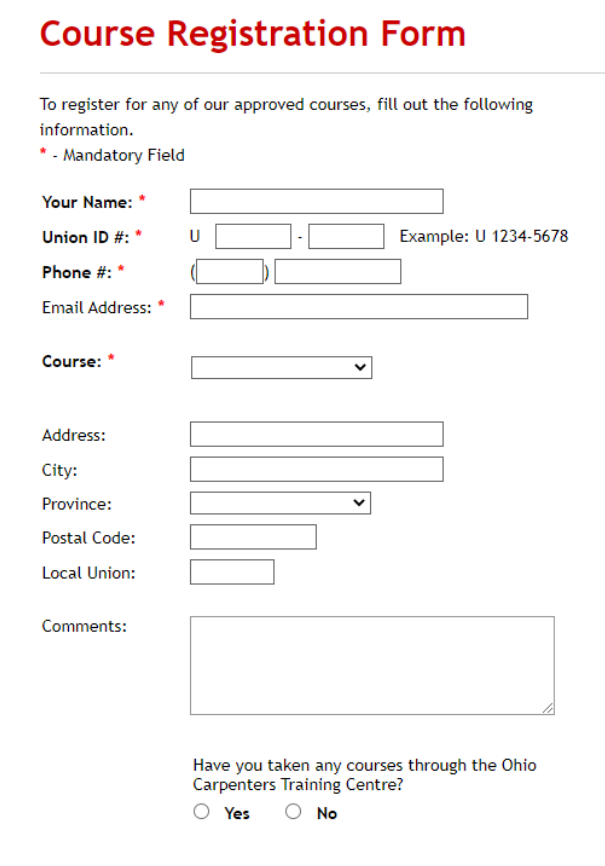

# Assignment 3

#### Web Development (Term 7)

Website created for the third assignment for WBD-1 course (IPM, IIMR)

## Objectives

- Design the pages such that they are visually appealing and the content is meaningful and informative. Use necessary HTML/CSS/JavaScript code to design the pages.
- Design a newsletter signup form
  - input fields (First Name, Last Name, Email address).
  - Use email address as a mandatory field for signing up
    - show appropriate form validation messages to the users
- Design a registration form
  - Following screenshot shows a registration form of a Carpenter Training Center
  - Design a form similar to the shown one and create its form validation script.

## Group

This is a submission for Group-17

- Nitish Kumar _(IPM01116)_
- Parth Mankad _(IPM01117)_
- Parth Rastogi _(IPM01118)_
- Pratham Chaudhary _(IPM01119)_
- Priyam _(IPM01121)_ [@xPsyBit](https://github.com/xPsyBit)
